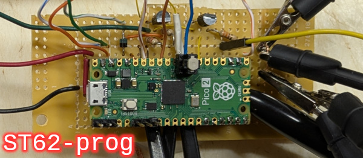
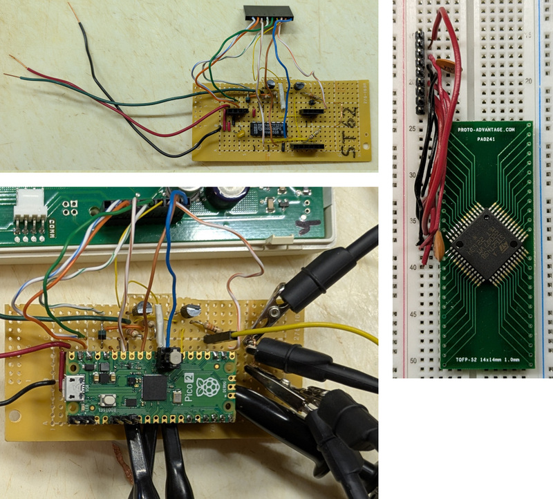

This project is a standalone programmer for ST62/ST63 cpu internal EPROM/EEPROM controlled by a Raspberry Pi Pico2.  It has sucessfully programmed several ST62T45B in-circuit.

All known previous programmers for these chips were implemented using the PC parallel printer port and proprietary software running on DOS or early Windows and are no longer readily available.

This programmer does not have a GUI or 2-way communication with a PC.  It uses UART serial communication to display output and all actions (dump or program), target cpu config, and the eprom/eeprom images are hard coded at compile time.


## GETTING STARTED

### SOFTWARE
Setup a pico-sdk environment (online tutorials) for a Pico2 board that creates these directories
```
pico
pico/pico-sdk
pico/pico-examples
```
Create `pico/pico-projects` and put this project into `pico/pico-projects/ST62-prog`. Copy CMakeLists.txt from pico-examples into pico-projects and edit to replace all add_subdirectory*() at the end with this line:
`add_subdirectory_exclude_platforms(ST62-prog)`  The following steps (Linux) in pico-projects directory will setup the project Makefiles:
```
mkdir build
cd build
setenv PICO_SDK_PATH ../../pico-sdk
cmake -DPICO_BOARD=pico2 ..
``` 
**To compile firmware:**
1.  Configure options in st62_prog.pio:  actions (dump or program) and target cpu TROMIN and SDOP pins active high or low
2.  In st62_prog.c modify all st62_program_region(), st62_writeEE_region() calls to match your target memory addresses.  Avoid many consecutive 0 for EPROM and consecutive 0xff for EEPROM in a region (see below).  Compile will halt with an error until this is done.
3.  convert image data for EPROM and EEPROM to C header format and add to prom-image.h
4.  compile firmware 3 times with different options (dump, program EPROM, program EEPROM) and rename output file for each.  Copy 1 of the 3 firmware .uf2 files onto the Pico2 (online tutorial).
```
cd pico/pico-projects/build/ST62-prog
make
mv st62_prog.uf2 st62_prog-DUMP.uf2
```

### HARDWARE
1.  Build the programmer hardware interface from schematic.pdf (component choices described in DESIGN.txt).  It's simple enough to build on perfboard/breadboard so no pcb design provided.
2.  Find your target cpu pin assignments in Table 2 or 3 of the Programming Specification document.  Make sure the target board doesn't connect any of the 6 signal pins directly to VDD/VSS.
3.  After initial tests (see below) without a target cpu, connect 8 wires from the interface to the target or adapter board pins identified in step 2 (header, pogo pins, or solder doesn't matter).  The target cpu must be powered by the programmer or uncontrolled EPROM programming may occur.

In-circuit programming requires special care.  My target board had a supercap on VDD which kept the Pico2 and target cpu running for several seconds after 5V supply shut off.  To prevent uncontrolled EPROM writes always turn off the VPP supply first.  For more protection add a reset button to the Pico2 and hold it down several seconds during supply shut off.

After building the interface and configuring/compiling the firmware (with define DISABLE_CHECKS), power the Pico2 without a target cpu connected.  You'll be able to see led behavior and serial output as well as check output signals with an oscilloscope or logic analyzer.  Be sure to comment out `define DISABLE_CHECKS` when done.

Firmware text output uses serial UART (needs a TTL to USB adapter) instead of the Pico2 USB connection because USB would power the Pico2 and target complicating power sequencing, won't provide >=5V to the target, and would delay start up and output pin drive by 3-4 seconds. Free serial terminal programs: picocom (Linux), kitty (Windows)
```
picocom -q -b 115200 -r -l /dev/ttyUSB0    or    /dev/ttyACM0
```

The first test with a target cpu connected should be dump EPROM.  A blank cpu will still have some data in the reserved locations.  First programming test should try to program 1-2 bytes in locations that are unused by your application.

Programming 3884 bytes takes 8 seconds and the led will blink but there is no serial output until programming is finished.  Serial output for successful programming will show `dbg_maxpcnt=1, dbg_progfail=0` followed by the EPROM dump.

This programmer does not perform a blank check because the reserved areas are target dependent.  The recommended 1st EPROM dump can be blank checked externally.

EPROM blank bytes are 0 therefore this programmer will skip over 0 in the rom image data.  Because of hard real-time requirements (see DESIGN.txt) do not call st62_program_region() with a region that contains many consecutive 0.  Break it up into multiple calls for smaller regions with no consecutive 0.  Same is true for 0xff in EEPROM and st62_writeEE_region().

## Resources
More details in DESIGN.txt and SPEC.txt  
Post with [ST62 & ST63 FAMILIES 8-BIT MICROCONTROLLERS OTP / EPROM PROGRAMMING SPECIFICATION](https://www.eevblog.com/forum/microcontrollers/need-to-programm-a-st62t10-mcu-help-finding-a-cheap-programmer/msg1620967/#msg1620967)  
[Comprehensive ST62 hw/sw info](http://matthieu.benoit.free.fr/st6.htm) (French)

## History
Programmer experiments and fine tuning were performed on a spare ST62T45B soldered to an adapter board (couldn't obtain a reasonably priced UV window version).  This was necessary because of vague/missing information in the Programming Specification document (details in SPEC.txt).  This picture shows the boards used plus the programmer connected for in-circuit programming of a target device.


